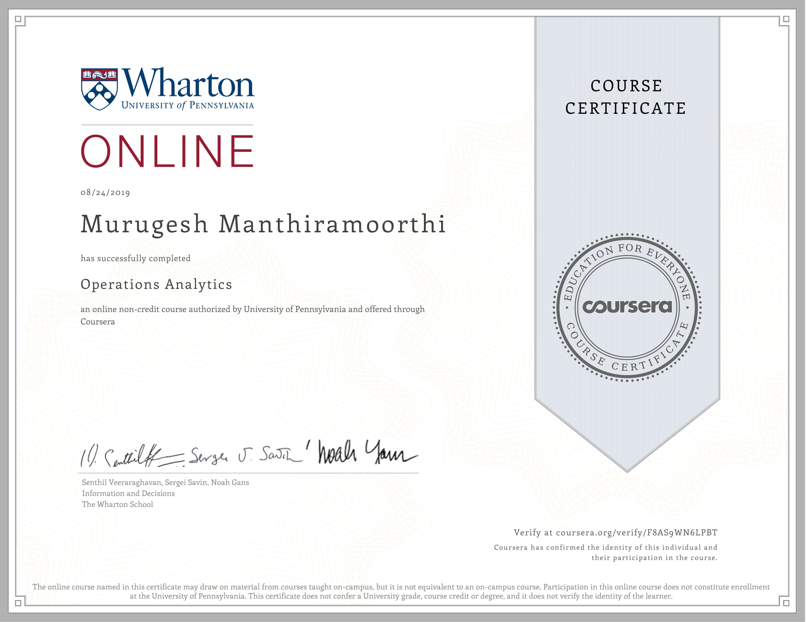

## SPECIALIZATION

---
### [01. Deep Learning](https://www.coursera.org/account/accomplishments/specialization/R84YKF5GP6R7){:target="_blank"}
**deeplearning.ai**

---
### [02. Machine Learning](https://www.coursera.org/account/accomplishments/specialization/RSNHF85LSVVQ){:target="_blank"}
**University of Washington**

---

---
## ONLINE COURSES
---

---
## SKILL TRAINING

---

---
## WORKSHOPS
---
